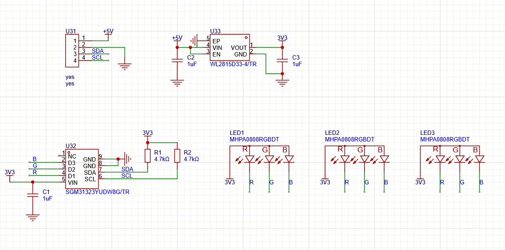

SGM31323 LED Driver for ESP32

The SGM31323 is a 3-channel, current-regulated RGB LED driver with an I2C-compatible interface. 
It is well suited for various applications powered by a 1-cellLi-Ion or Li-Polymer, 
or systems with 3.3V or 5V supply voltages, 
as well as 3-cell NiCd, NiMH or Alkaline batteries. 
No external components are required for the three constant current sinks.

<video src='demo.mp4'/>
